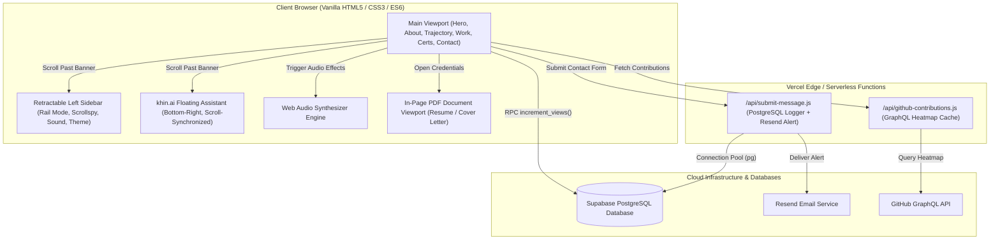

# Portfolio-V2 — System Documentation & Technical Specification

A modern, high-performance developer portfolio showcasing dual capabilities in **Data Engineering** and **Data Analytics**. This application features modular stylesheets, real-time database telemetry, serverless PostgreSQL messaging, Web Audio acoustic synthesis, an interactive career trajectory graph, and **khin.ai**—a specialized minimal AI assistant bot stickied to the bottom-right corner and synchronized with the left navigation rail.

---

## 📑 Table of Contents
1. [System Architecture & Workflow](#-system-architecture--workflow)
2. [Complete Technology Stack & Libraries](#-complete-technology-stack--libraries)
3. [khin.ai — Minimal Portfolio AI Assistant](#-khinai--minimal-portfolio-ai-assistant)
4. [Core Subsystems & Process Workflows](#-core-subsystems--process-workflows)
5. [Project Directory Structure](#-project-directory-structure)
6. [Environment Variables & Requirements](#-environment-variables--requirements)
7. [Local Development & Deployment Guide](#-local-development--deployment-guide)
8. [System Review & Verification Matrix](#-system-review--verification-matrix)

---

## 🏛️ System Architecture & Workflow



---

## 🛠️ Complete Technology Stack & Libraries

### 🖥️ 1. Frontend (Client-Side)
* **Core Markup & Logic**:
  * **HTML5**: Semantic document structure with high-contrast accessibility labels, ARIA landmarks, and modular section layout.
  * **JavaScript (Vanilla ES6+)**: Native module-less execution, eliminating bundler overhead. Drives DOM interactions, scrollspys, typewriter algorithms, interactive tab transitions, audio generation, and client-side AI intent resolution.
* **Modular CSS3 Architecture**:
  * **Global Variables (`:root`)**: Manages color palettes, card shadows, font sizes, transitions, and dynamic tokens.
  * **Dark / Light Dual-Theme**: Managed via `.dark-mode` and `.theme-light` body classes. Includes dynamic image asset switching (e.g. dark toga photo vs. transparent PNG cutout).
  * **Sectional Stylesheet Imports**: Aggregate loading via `@import` rules inside [`assets/css/index.css`](file:///C:/Users/gambo/repos/khin-portfolio-v2/assets/css/index.css):
    * [`home.css`](file:///C:/Users/gambo/repos/khin-portfolio-v2/assets/css/home.css): Hero presentation, infinite vertical skills marquee loop, quick stats cards.
    * [`about.css`](file:///C:/Users/gambo/repos/khin-portfolio-v2/assets/css/about.css): Profile card, 4-metric borderless summary strip, GitHub contribution heatmap layout.
    * [`skills.css`](file:///C:/Users/gambo/repos/khin-portfolio-v2/assets/css/skills.css): Interactive segmented control pills, technology grid cards, hover effects.
    * [`certifications.css`](file:///C:/Users/gambo/repos/khin-portfolio-v2/assets/css/certifications.css): 3D perspective flip cards, credential badges, and zoom preview modals.
    * [`education.css`](file:///C:/Users/gambo/repos/khin-portfolio-v2/assets/css/education.css): SVG cubic bezier growth curve, milestone nodes, and expandable drawers.
    * [`work.css`](file:///C:/Users/gambo/repos/khin-portfolio-v2/assets/css/work.css): Tabbed project showcases (Builds / Data Engineering & Collective / Analytics), card overlays.
    * [`contact.css`](file:///C:/Users/gambo/repos/khin-portfolio-v2/assets/css/contact.css): Contact grid, social link micro-interactions, input states, and submission spinner.
    * [`footer.css`](file:///C:/Users/gambo/repos/khin-portfolio-v2/assets/css/footer.css): Compact footer with live system view counter.
    * [`sidenav.css`](file:///C:/Users/gambo/repos/khin-portfolio-v2/assets/css/sidenav.css): Retractable glassmorphic left sidebar navbar, rail mode, sound toggle, and typing terminal.
    * [`khin-ai.css`](file:///C:/Users/gambo/repos/khin-portfolio-v2/assets/css/khin-ai.css): Fixed sticky bottom-right widget styling, synchronized opacity triggers, message bubbles, and responsive mobile overrides.

### 🌐 2. External Libraries & CDNs
| Library / CDN | Version / Source | Implementation Purpose |
| :--- | :--- | :--- |
| **Lucide Icons** | `@latest` via unpkg CDN | Standardized, crisp UI icons rendered dynamically via `lucide.createIcons()`. |
| **Supabase Client** | `@supabase/supabase-js@2` via jsDelivr CDN | Real-time page view telemetry hitting the `increment_views()` stored procedure. |
| **Devicon CDN** | `@latest` via jsDelivr CDN | High-fidelity vector logos for programming languages, databases, and DevOps tools. |
| **Google Fonts** | Google Web Fonts API | Primary typography pairing: **Poppins** (headings), **Inter** (copy), **JetBrains Mono** (code). |

### ⚙️ 3. Backend & Infrastructure (Server-Side)
* **Runtime**: **Node.js (ES6 Modules)** configured with `"type": "module"` in [`package.json`](file:///C:/Users/gambo/repos/khin-portfolio-v2/package.json).
* **Hosting Platform**: **Vercel Edge Network**, mapping `/api/*.js` files directly to serverless edge endpoints.
* **Database Driver**: [`pg`](https://www.npmjs.com/package/pg) (`^8.11.3`) PostgreSQL connection pool client supporting SSL encryption for cloud database providers.
* **Email Dispatch**: **Resend REST API**, delivering formatted HTML alerts with sender verification.
* **Version Control Heatmap**: **GitHub GraphQL API**, fetching real-time contribution counts for `@sondre01` with edge caching headers (`s-maxage=120, stale-while-revalidate=300`).

---

## 🤖 khin.ai — Minimal Portfolio AI Assistant

**`khin.ai`** is a dedicated in-browser assistant designed to provide fast, reliable, zero-latency answers about Khin Andrei, his engineering background, his skills, his projects, his certifications, and this website.

### 1. Unique Brand Logo Inspired by Khin's Monogram
* **Inspiration**: Directly derived from Khin's signature geometric monogram (`< - /` representing **KH**).
* **Visual Elements**:
  * Architectural left-pointing chevron (`<`) with chamfered tips.
  * Central connecting horizontal crossbar (`-`).
  * Forward-slanted slash (`/`) with negative-space cutouts.
  * **Generative AI Star (`✦`)**: An illuminated 4-point radiant AI star positioned at the top-right apex of the slash in signature orange accent (`#ff5e00`).
* **Available Formats**:
  * **Scalable Vector SVG**: [`data/logo/khin-ai-logo.svg`](file:///C:/Users/gambo/repos/khin-portfolio-v2/data/logo/khin-ai-logo.svg) — Infinitely scalable, lightweight, and theme-reactive.
  * **Master Artwork**: [`data/logo/khin-ai-logo.jpg`](file:///C:/Users/gambo/repos/khin-portfolio-v2/data/logo/khin-ai-logo.jpg) — High-resolution brand badge.

### 2. Sticky Placement & Left-Sidebar Scroll Synchronization
* **Bottom-Right Fixed Coordinates**: Located at `bottom: 24px; right: 24px; z-index: 9995;` (`position: fixed`).
* **Synchronized Display State**:
  * On the initial landing hero, both the left sidebar and `khin.ai` are hidden.
  * The moment the user scrolls past the separator banner (`rect.top <= 130`), the controller adds `body.side-nav-visible`.
  * `body.side-nav-visible .khin-ai-widget` transitions from `opacity: 0; transform: translateY(22px)` to `opacity: 1; transform: translateY(0); pointer-events: auto;`.
  * If the user scrolls back to the top hero section, both the left navigation bar and `khin.ai` fade away together.

```css
/* Synchronization Rule in assets/css/khin-ai.css */
.khin-ai-widget {
    position: fixed;
    bottom: 24px;
    right: 24px;
    z-index: 9995;
    opacity: 0;
    visibility: hidden;
    pointer-events: none;
    transform: translateY(22px) scale(0.92);
    transition: opacity 0.38s cubic-bezier(0.16, 1, 0.3, 1),
                transform 0.38s cubic-bezier(0.16, 1, 0.3, 1),
                visibility 0.38s;
}

body.side-nav-visible .khin-ai-widget {
    opacity: 1;
    visibility: visible;
    pointer-events: auto;
    transform: translateY(0) scale(1);
}
```

### 3. Knowledge Base & Strict Domain Scope Guardrails
Implemented in [`assets/js/khin-ai.js`](file:///C:/Users/gambo/repos/khin-portfolio-v2/assets/js/khin-ai.js), the bot is programmed with strict guardrails:
* **In-Scope Topics**:
  * **Identity & Education**: Khin Andrei Gamboa (*Sondre*), BS Computer Engineering from Rizal Technological University (RTU).
  * **Skills**: Data Engineering, ETL/ELT pipelines, SQL, PostgreSQL, Python, Snowflake, Power BI, Tableau, Excel, Docker, PowerShell.
  * **Featured Projects**: *Social Media ETL Pipeline*, *FOVB-AIOT Capstone*, *AI Kilo Bot*, *RFID Tollgate System*, *Xvidia Shop*, and *GG Resto POS Dashboard*.
  * **Qualifications**: DataCamp Associate Data Engineer (`DEA0017096233010`), SQL Track, Cisco Python Essentials, IBM/TESDA, Credly badges.
  * **Experience**: Staff Domain Inc. (6-month IT Systems & Operations immersion), Freelance Engineering.
  * **Contact & Socials**: Email (`gamboa.khinandrei@gmail.com`), LinkedIn, Credly, Instagram, Facebook, and the on-page form.
  * **Documents**: Direct download and built-in interactive viewer integration for Resume and Cover Letter.
  * **Website Architecture**: Explanation of frontend, backend, database telemetry, audio synthesizer, and dual views.
* **Strict Deflection Protocol**:
  If asked about unrelated subjects (e.g. general trivia, coding homework, recipes, politics, outside companies), the bot politely and firmly declines:
  > *"I am **khin.ai**, Khin Andrei's dedicated portfolio AI assistant. To keep our discussion productive, I am strictly programmed to answer questions about Khin Andrei, his skills, projects, certifications, experience, and this website."*
* **Interactive In-Message Action Chips**:
  Bot responses include clickable chips that trigger direct actions:
  * `[Jump to Projects Section]` -> Smoothly scrolls to `#work`.
  * `[Go to Contact Form]` -> Smoothly scrolls to `#contact` and focuses the name input.
  * `[Open Resume in Viewer]` -> Invokes `window.openDocumentViewport('resume')`.
  * `[Verify Credential]` -> Opens official DataCamp verification links.

---

## ⚙️ Core Subsystems & Process Workflows

### 1. Real-time Telemetry (Views Counter)
* **Mount Trigger**: On page load, the Supabase client checks whether the visit has been logged for this browser session.
* **Database RPC**: Hits the Supabase stored procedure `increment_views()`.
* **Animated Rolling Count-Up**: The frontend detects when the telemetry counter enters the viewport via `IntersectionObserver` and runs a smooth JavaScript easing counter that counts up to the total views stored in the database.

### 2. Contact Message Logger & Resend Email Forwarder
* **Frontend Handling**: Form submit event on `#contact-form` intercepts default submit behavior, disables the submit button, and activates an animated CSS loading spinner.
* **Serverless Execution** ([`api/submit-message.js`](file:///C:/Users/gambo/repos/khin-portfolio-v2/api/submit-message.js)):
  1. Validates `name`, `email`, `phone`, `subject`, and `message`.
  2. Queries the connection pool to insert inquiry details into the Supabase PostgreSQL table:
     ```sql
     INSERT INTO public.portfolio_messages (full_name, email_address, contact_number, subject, message)
     VALUES ($1, $2, $3, $4, $5);
     ```
  3. Uses `fetch()` to call `https://api.resend.com/emails` with a custom branded HTML email alert delivered directly to `RECIPIENT_EMAIL`.
  4. Returns `{ success: true, dbLogged: true, emailSent: true }` to the client.

### 3. GitHub Real-time Contributions Heatmap
* **Endpoint** ([`api/github-contributions.js`](file:///C:/Users/gambo/repos/khin-portfolio-v2/api/github-contributions.js)):
  * Queries GitHub's official GraphQL API using `GITHUB_TOKEN`.
  * Extracts the user's `contributionsCollection` for the past 52 weeks.
  * Renders an interactive green SVG square grid with commit counts and level classifications (0 to 4).
  * Includes edge caching (`s-maxage=120`) to prevent API rate limiting.

### 4. Interactive Document Viewport (Resume & Cover Letter)
* **Custom Viewport Modal**: Element `#custom-doc-viewport` displays documents inside a sandbox-isolated iframe with custom toolbar controls (`#docVpDownloadBtn`, `#docVpCloseBtn`).
* **Global Controller**: Exposes `window.openDocumentViewport(docType)` allowing triggers from top-nav buttons, sidebar links, inline word links, and `khin.ai`.

### 5. Web Audio API Acoustic Synthesizer
* **Audio Context Generator**: Lazily initializes `window.AudioContext` on first user gesture.
* **Oscillator Synthesis** (`playUiSound(freq, duration, type, gainAmt)`):
  * Generates short frequency bursts with exponential gain decay to produce tactile, click sounds without audio file downloads.
  * Respects sound mute toggle state stored in `localStorage.getItem('khin_portfolio_sound')`.

### 6. Dual Portfolio View Switcher
* **Portfolio View (`#khinandrei-portfolio-view`)**: Full personal presentation with all 7 interactive sections.
* **Data & Dev View (`#data-dev-view`)**: Dedicated view highlighting technical repositories, system architecture, and specialized engineering tools.
* Switched dynamically via `showDataDevView()` and `showKhinAndreiView()`.

---

## 📦 Project Directory Structure

```
Portfolio-V2/
├── .env.example                     # Reference file for cloud environment variables
├── .gitignore                       # Git exclusion list
├── DEVELOPMENT.md                   # Development journey & implementation history
├── README.md                        # Primary system documentation & technical specification
├── favicon.ico                      # Website favicon (ICO format)
├── favicon.png                      # Website favicon (PNG format)
├── index.html                       # Primary application template, DOM structure & script engine
├── package.json                     # Node.js manifest ("pg": "^8.11.3", "type": "module")
├── vercel.json                      # Vercel deployment & routing configuration
│
├── api/                             # Serverless Node.js edge functions (Vercel)
│   ├── github-contributions.js      # GraphQL proxy for live GitHub commit heatmap
│   ├── send-email.js                # Standalone Resend email dispatch endpoint (legacy)
│   └── submit-message.js            # Consolidated PostgreSQL logger + Resend forwarder
│
├── assets/                          # Static style sheets, scripts & visual assets
│   ├── css/                         # Modular CSS3 architecture
│   │   ├── about.css                # Profile overview, bio narrative, stats strip, GitHub heatmap
│   │   ├── certifications.css       # 3D flip card qualifications layout & credentials
│   │   ├── contact.css              # Contact card, social link arrows & message form
│   │   ├── education.css            # Career trajectory SVG area graph & milestone drawers
│   │   ├── footer.css               # Compact footer & telemetry counter layout
│   │   ├── home.css                 # Hero showcase, typewriter headline, skills marquee loop
│   │   ├── index.css                # Global stylesheet aggregating all imports & theme tokens
│   │   ├── khin-ai.css              # khin.ai floating assistant styling & scroll synchronization
│   │   ├── sidenav.css              # Retractable glassmorphic left sidebar navbar & rail mode
│   │   ├── skills.css               # Interactive skills tab control & technology cards
│   │   └── work.css                 # Featured project cards, 3D flip interactions & detail views
│   └── js/                          # Client-side JavaScript libraries
│       └── khin-ai.js               # khin.ai natural language engine, domain ontology & guardrails
│
└── data/                            # Media assets, documents & branding graphics
    ├── documents/                   # Official credentials & PDFs
    │   ├── certificates/            # High-resolution certificate scans (DataCamp, Cisco, IBM)
    │   ├── cover_letter/            # Official PDF cover letter
    │   └── resume/                  # Official PDF resume
    ├── image/                       # Portfolio photos, project screenshots & transparent PNGs
    └── logo/                        # Brand marks & vector emblems
        ├── khin-ai-logo.svg         # khin.ai custom vector logo with orange AI sparkle
        ├── khin-ai-logo.jpg         # khin.ai high-resolution brand badge artwork
        ├── logo-box.png             # Original Khin monogram logo
        └── logo-box (1).png         # High-resolution monogram source asset
```

---

## 🔐 Environment Variables & Requirements

To enable database telemetry, form submission logging, and real-time GitHub integration, set the following environment variables in your **Vercel Project Settings** (`Settings -> Environment Variables`):

| Variable Name | Required For | Example Value / Format | Description |
| :--- | :--- | :--- | :--- |
| `DATABASE_URL` *(or `POSTGRES_URL`)* | `/api/submit-message.js` | `postgresql://postgres:[PASSWORD]@[HOST]:5432/[DB]` | Secure connection string to your Supabase PostgreSQL database. |
| `RESEND_API_KEY` | `/api/submit-message.js` | `re_1234567890abcdef...` | Private API key generated from the [Resend Dashboard](https://resend.com). |
| `RECIPIENT_EMAIL` | `/api/submit-message.js` | `gamboa.khinandrei@gmail.com` | Destination inbox where contact form submissions will be forwarded. |
| `GITHUB_TOKEN` | `/api/github-contributions.js` | `ghp_1234567890abcdef...` | GitHub Personal Access Token (classic or fine-grained) with `read:user` permission. |

### PostgreSQL Table Schema (Supabase)
Ensure the following table exists in your database:
```sql
CREATE TABLE IF NOT EXISTS public.portfolio_messages (
    id SERIAL PRIMARY KEY,
    full_name VARCHAR(255) NOT NULL,
    email_address VARCHAR(255) NOT NULL,
    contact_number VARCHAR(50),
    subject VARCHAR(255),
    message TEXT NOT NULL,
    submitted_at TIMESTAMP WITH TIME ZONE DEFAULT CURRENT_TIMESTAMP
);
```

---

## 🚀 Local Development & Deployment Guide

### Local Development
1. Open the project folder in **Visual Studio Code**.
2. Install the **Live Server** extension (`ritwickdey.liveserver`).
3. Click **Go Live** on the bottom status bar.
   * By default, it will serve on `http://127.0.0.1:5501` (configured in `.vscode/settings.json`).
4. In local development:
   * Frontend interactions, animations, theme toggles, audio effects, document viewing, and **`khin.ai`** will function immediately.
   * To test backend functions locally, run the Vercel CLI:
     ```bash
     npm install -g vercel
     vercel dev
     ```

### Deploying to Production (Vercel)
1. Push your repository to GitHub:
   ```bash
   git add .
   git commit -m "Deploy Portfolio V2 with khin.ai"
   git push origin main
   ```
2. Connect your repository in the **Vercel Dashboard**.
3. Under **Project Settings -> Environment Variables**, configure:
   * `DATABASE_URL`
   * `RESEND_API_KEY`
   * `RECIPIENT_EMAIL`
   * `GITHUB_TOKEN`
4. Click **Deploy**. Vercel will automatically host the static files and map `/api/*` to edge serverless functions.

---

## ✅ System Review & Verification Matrix

Use this matrix to audit every subsystem during code and system reviews:

| Component | Target Location | Verification Method |
| :--- | :--- | :--- |
| **khin.ai Visibility** | Bottom-right screen | Verify widget is hidden on hero; verify it slides in when scrolling past separator banner (`body.side-nav-visible`). |
| **khin.ai Guardrails** | In-chat prompt | Ask: `"Tell me a cake recipe"`. Verify bot deflects and stays focused on Khin Andrei's portfolio. |
| **khin.ai Navigation** | In-chat action chips | Click `[Featured Projects]`. Verify smooth scroll down to `#work`. |
| **khin.ai Logo** | Header & Launcher | Verify custom `< - /` monogram with `#ff5e00` AI star renders crisp in SVG and high-res image. |
| **Left Sidebar Nav** | Left edge | Verify sidebar slides in on scroll past banner; verify retract button minimizes to 68px rail mode. |
| **Theme Switcher** | Sidebar / Header | Toggle Dark/Light mode; verify CSS variables, background tones, and transparent images update. |
| **Audio Synthesizer** | Sidenav sound button | Toggle sound ON; click buttons/tabs; verify pitch-generated synthesizer clicks play. |
| **Document Viewport** | Document links / Resume | Click `RESUME`; verify modal iframe opens with PDF preview and functional download button. |
| **Contact Form** | `#contact` section | Submit a test message; verify insertion in Supabase `portfolio_messages` and email delivery via Resend. |
| **Heatmap Sync** | `#about-github-container` | Verify contribution squares reflect GitHub commit activity for `@sondre01`. |
